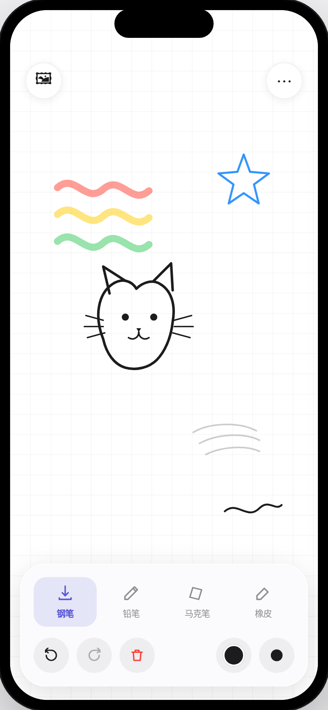
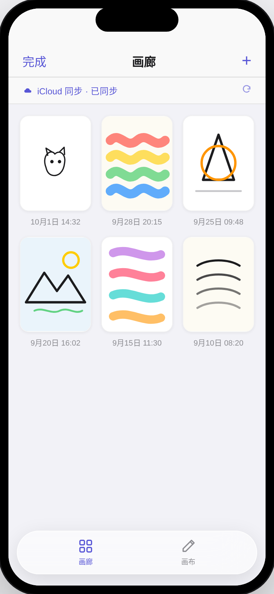

# 墨迹 SketchPad

一个用 **SwiftUI + PencilKit** 写的 iOS 绘画工具应用。iOS 原生风格界面，支持 Apple Pencil 压感。

<p align="center">
  
  &nbsp;&nbsp;&nbsp;&nbsp;
  
</p>

> 📷 上图为界面示意图（根据真实布局 1:1 还原）。欢迎在真机运行后拍摄实际截图替换。

## 功能

| 模块 | 说明 |
| --- | --- |
| **画笔** | 钢笔 / 铅笔 / 马克笔 / 橡皮擦，切换即时生效 |
| **颜色** | 20 色预设色板 + 系统取色器自定义颜色 |
| **笔刷粗细** | 5 档预设（3 / 6 / 10 / 16 / 24 pt） |
| **画纸** | 白纸 / 黑纸 / 米黄 / 方格 / 横线，显示与导出完全一致 |
| **撤销重做** | 对接系统 UndoManager，按钮实时反映可用状态 |
| **保存** | 存到本地画廊（可再次编辑）、存到系统相册 |
| **分享** | 导出 PNG 走系统分享面板 |
| **画廊** | 网格缩略图浏览，长按删除，点按继续编辑 |
| **iCloud 同步** | 画作自动同步到 iCloud Drive，多设备共享；未登录自动降级本地 |

## 运行方式

```bash
open SketchPad.xcodeproj
```

1. 用 Xcode 15 或更高版本打开 `SketchPad.xcodeproj`
2. 在 `TARGETS → SketchPad → Signing & Capabilities` 里选择你的开发者账号
   （模拟器运行可跳过；真机运行必须选，否则签名会失败）
3. 选择任意 iPhone 模拟器或真机，按 `⌘R` 运行

**环境要求**：Xcode 15+，iOS 16.0+，Swift 5

## 开启 iCloud 同步（需手动做一次）

代码和 entitlements 文件已就绪，但 iCloud 能力**必须在 Xcode 里勾选**才能生成正确的签名：

1. Xcode 里点左侧最上面的蓝色 **SketchPad** 项目图标
2. 选 **Signing & Capabilities** 标签
3. 左上角 **+ Capability** → 搜索 **iCloud** → 双击添加
4. 在出现的 iCloud 区块里勾选：
   - ☑️ **Cloud Documents**
   - Container 选 `iCloud.com.sketchpad.ink`（没有的话点 **+** 新建，名字必须一致）
5. 确认 **Team** 已选择（免费 Apple ID 的 Personal Team 也支持 iCloud）
6. 按 `⌘R` 重新运行

> ⚠️ **Container 名称必须与代码一致**：`ArtworkStorage.containerIdentifier = "iCloud.com.sketchpad.ink"`。
> 如果你改了 Container 名，记得同步改这个常量。

**验证是否生效**：打开 App 的「画廊」，顶部会显示状态条：

- 蓝色 `iCloud 同步 · 已同步` → 生效了
- 灰色 `iCloud 未开启 · 画作仅保存在本机` → 没生效，检查上面的步骤

> 💡 **模拟器测试提示**：模拟器需要先登录 iCloud 账号
> （模拟器 → 设置 → 登录 iPhone → 输入 Apple ID），否则会走本地降级模式。

## iCloud 同步实现说明

| 环节 | 做法 |
|---|---|
| 存储路径 | `FileManager.url(forUbiquityContainerIdentifier:)` 拿到容器 → `Documents/Artworks/` |
| 降级策略 | `ubiquityIdentityToken == nil` 或容器创建失败时，自动回退 `Documents/Artworks/`，App 不崩 |
| 首次迁移 | 启用 iCloud 后把本地存量画作复制过去（已存在的不覆盖） |
| 按需下载 | 读取前检查 `ubiquitousItemDownloadingStatus`，未下载的调 `startDownloadingUbiquitousItem` 并轮询等待 |
| 变更监听 | `NSMetadataQuery` 监听 `.drawing` 文件，其他设备的改动自动刷新画廊 |
| 账号切换 | 监听 `.NSUbiquityIdentityDidChange`，登录/登出时重新解析容器 |
| 缩略图兜底 | iCloud 缩略图未下载时，现场从 `PKDrawing` 渲染一张，避免画廊空白 |

## 目录结构

```
SketchPad/
├── SketchPad.xcodeproj/          # Xcode 工程（含共享 scheme）
└── SketchPad/
    ├── SketchPadApp.swift        # App 入口
    ├── Info.plist                # 相册写入权限、横竖屏配置
    ├── SketchPad.entitlements    # iCloud 容器权限声明
    ├── Models/
    │   ├── BackgroundStyle.swift # 画纸样式与 pattern 绘制
    │   ├── ArtworkStorage.swift  # iCloud / 本地存储层
    │   └── DrawingStore.swift    # 全局状态、导出、画廊持久化
    ├── Views/
    │   ├── CanvasView.swift      # PKCanvasView 的 SwiftUI 封装
    │   ├── DrawingScreen.swift   # 主界面（画布 + 顶栏 + 工具面板）
    │   ├── ToolPanel.swift       # 底部工具面板
    │   ├── GalleryView.swift     # 本地画廊 + iCloud 状态条
    │   └── Components.swift      # 颜色面板、分享面板、通用按钮
    └── Assets.xcassets/          # App 图标与强调色
```

## 实现要点

- **画布**：`PKCanvasView` 用 `UIViewRepresentable` 封装，`drawingPolicy = .anyInput` 让手指和 Pencil 都能画。画布单屏不滚动（`isScrollEnabled = false`），配合外层 `ignoresSafeArea` 实现全屏作画。
- **状态同步**：`DrawingStore` 是唯一的 `ObservableObject`。画布内容通过 delegate **单向**回写到 store（`updateDrawing` 不触发 `@Published`），避免绘画过程中高频刷新视图导致掉帧；工具/颜色/粗细变化才走 `@Published` 驱动画布更新。
- **撤销重做**：直接复用 `PKCanvasView.undoManager`，delegate 里刷新 `canUndo` / `canRedo`，且仅在值真正变化时赋值。
- **导出所见即所得**：`renderImage()` 用同一个 `UIGraphicsImageRenderer` 绘制背景 + 笔画，背景使用与屏幕显示相同的 `UIColor(patternImage:)`，因此方格/横线画纸导出后与屏幕一致（默认 2x，画廊缩略图用 1x）。
- **本地持久化**：`PKDrawing.dataRepresentation()` 存到 `<根目录>/Artworks/<uuid>.drawing`，同时导出 `<uuid>.png` 作缩略图；画廊按修改时间倒序排列。根目录由 `ArtworkStorage` 决定——iCloud 可用时是 iCloud 容器，否则是 App 沙盒。
- **iCloud 降级不崩**：整个同步逻辑对用户是透明的。没登录 iCloud、没开权限、容器创建失败——任一环节出问题都静默回退本地存储，功能照常可用，只少了跨设备同步。

## 可扩展方向

- 图层系统（多 `PKCanvasView` 叠加 + 混合模式）
- 画布缩放平移（把 `isScrollEnabled` 和 `zoomInteractionEnabled` 打开并加手势切换）
- 手动画作重命名、标签分类、搜索
- 压感曲线自定义、导入图片作为底图描摹
- 导出 PDF / 视频回放笔迹过程

## License

本项目基于 [MIT License](LICENSE) 开源，可自由使用、修改与分发，需保留版权声明。

## 注意

- 该应用使用 CodeBuddy 生成，不一定能正确运行！